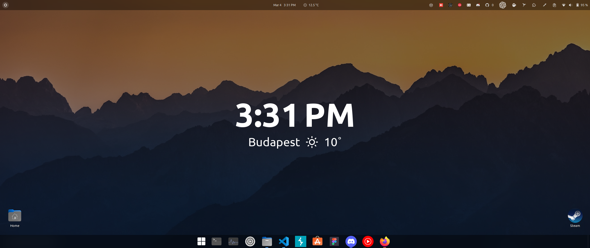

# Dynamic Wallpaper (Only for GNOME right now)
## DW is another smaller project I created, it has a clock and weather information. The wallpaper updates every minute and mainly uses [Tabliss](https://web.tabliss.io/) (a chrome and firefox extension). Also, it updates the background image every 5 minutes from [Unsplash](https://unsplash.com).

# Configuration
```json
{
    // Set this to your monitor's width and height.
    "width": 2560,
    "height": 1080,
    // Visual settings
    "backgroundOpacity": 0.5,
    "timeWidgetFontSize": 36,
    "weatherWidgetFontSize": 56,
    // Weather location (I recommend testing the location it on web.tabliss.io first then put it in this config)
    "weatherLocation": "Budapest",
    // Full location for an offline wallpaper.
    "offlineWallpaperPath": "/home/suni29/Pictures/Wallpapers/SurfacePro/dark-mountain-valley-wheat-field.jpg"
}
```
# Autostart
### To autostart DW use [PM2](https://pm2.keymetrics.io/), here is a guide on how to do it:
```bash
$ pm2 startup
```
### Follow the instructions from the output then run this 2 commands:
```bash
$ pm2 start index.js --name DynamicWallpaper
$ pm2 save
```
# Features
- [x] Dynamic clock and weather widget.
- [x] Dynamic wallpaper change.
- [x] Offline checking 
# Known bugs
- ### Offline wallpaper gets overwritten.
- ### If the program is started offline then the background image will be black for 1-2 updates.
# Credits
### [Tabliss](https://tabliss.io/) and [Unsplash](https://unsplash.com).
